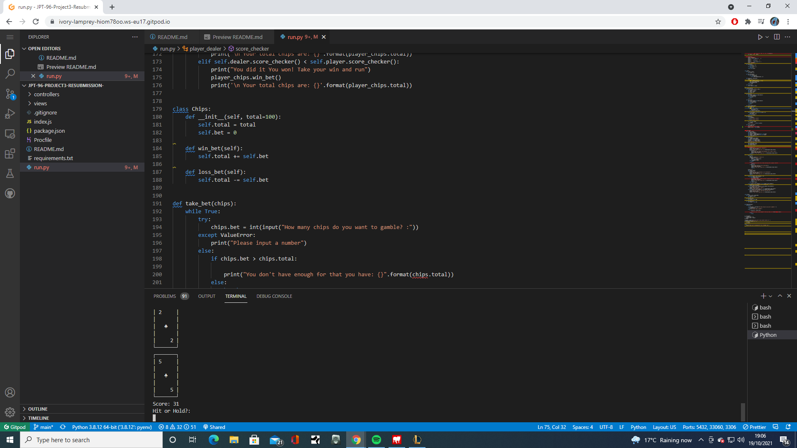

# JPT-96-MSProject3(Black Jack)-Resubmission

## About
For my Python project I decided to go with a very simple version of black Jack game.

[click here](https://jpt-96-blackjack-resubmission.herokuapp.com/) to see deployed game.

## Contents

1. [Project Goals](#project-goals)
2. [User Goals](#user-goals)
3. [Features](#features)
4. [Structure](#structure)
    1. [Home Screen](#home-screen)
    2. [Place Bet](#place-bet)
    3. [Hit or Hold](#hit-hold)
    4. [End Game Result](#end-game-result)
5. [Design](#design)
6. [Function Purposes](#function-purposes)
7. [User Stories](#user-stories)
8. [Technologies Used](#technologies-used)
9. [Testing](#testing)
10. [Future Features](#future-features)
11. [Deployment](#depolyment)

## Project Goals
my project goals are:
- create a BlackJack game that is easy to use.
- to take a gamble input
- to have readable cards
- a easy to follow score system

## User Goals
my user goals are:
- easy instructions if player doesn't follow the steps
- to have a basic understanding of Python

## Features
This game has cards and a simple hit or hold function and will keep going till you hit 21.
It has some fun print statements in it to give the player something more interesting to look at rather than just "Dealer wins" or "Player wins".
It also now has a error message if hit or hold isn't entered to remind the user of what is required with a reminder that capitalisation is also required.

## Structure
The structure of this BlackJack game relys on user inputs in order to work.

### 1. Home Screen

    
Click here to view the home screen

This is Home/loading screen. It has a simple welcome message and a prompt to enter a gambling bet.

### 2. Place Bet

    
Click here to view the gambling portion

This shows that a input has been made for the amount of chips the user is betting.

### 3. Hit or Hold

    
Click here to view the hit/hold

This shows another card is printed when Hit is inputed into the console.

### 4. End Game result

    
Click here to view the home screen

This shows the end result of a turn.

## Design
The design of the cards is used with print statements using | and - to for the bases of a card whilst calling f prints to print the value of said card.

### Function Purposes 
In this sub section I would like to go over my functions and give a breif run down of what they do and the objective that they achieve.
This will show my thought process and even help others that wish to do a similar project.

## Import
So first thing you need to do is import random. This is very important because you need the deck to be shuffled and distributed randomly this allows for a fair game.

## Functions & Classes
### card
This first function is called card.
This is essentially comprised of a list with the values of the cards which get reassinged in the print statements. In order to create the cards
underneath this we give the __init__ within  this class, we then assign self to all neccessary variables. 
After this we then define the value of the cards with things like >= 10 for example.

### deck
We create an empty list that has the self.cards.
In here we begin with creating the actual deck by generating 52 cards and create 4 suits of each.
After this we then append it to the card using the I and J used to create the 52 cards and the different suits.
### Draw
Inside the draw function we are simply itterating and appending to the self.cards which is defined later on.
As well as appending to the card we defined earlier, when this is done at the end we return cards (not card see what I mean about naming conventions)
.
### count 
This is one line of code that reads the length of the self.cards.

### player and dealer
Within this class we essentially are assigning cards as a empty list, dealer = dealer score= 0 etc etc.
From here we create the deal and hit functions. This is essentially checking if the score equats to 21 and if the player
wants to hit, if so then we extend the hand essentially by adding another card. 
After this we do our ace alteration, by essentially saying if score is over 21 we assign it the value of 1 else it is a 11.
Once the score hit's 21 we reveal the cards of both players. We also later down the line figure out if the dealer or player has 21. 

### the game 
In here is where we essentially put in the rules. What it takes to bust what it takes to win which is having a higher score but not over 21.
I also put in a way if the dealer has under 17 the dealer should hit as it is highly unlikely it will bust making the game a bit more competitve.
We then reveal both players cards when the player is happy and the dealer is over 17. We then compare results and add appropriate print statements.
I then iniate the game by going b = the_game b.round() which is a function defined earlier in the code

This is a very basic run through of the functions and classes but gives you some idea of my thought process and approach towards this project.

### Chips 

This class has been created in order to create a currency within the game. This allows for a more immersive experience within the game.
within the __init__ the main value is defined at 100 so that the player always starts at 100 chips. It then has a bet portion which is set at zero.
This is then defined in the take_bet function. But other than that it simply adds the bet to the player chips or removes the player chips.

### Take_bet
In this function it takes a while true statement, with the following. Try chips.bet and give it a input. If it is over the alloted amount of chips
it will print a message saying you dont have enough chips for that. Or if you don't input a interger it will take a expect value error and ask you for a number.

## Future Features
I would like to do a couple of turns in this project  that would allow the player to get a couple of rounds in and fully enjoy this project.

## User Stories

### User story 1
I would like to be able to input my bet easily and be reminded if I am over my chips.

    
Click here to view the Chip reminder

This shows the user that they have asked for too many chips and given a reminder of the maximum they can use and asks them again how much they would like the gamble.
And I like that there is a fail safe that it will only take numbers so nothing bad or strange can happen.

    
Click here to view the input Number prompt

### User story 2

I just want a easy to follow game with minimal instructions. Which has been achieved with this game.

    
Click here to view the full game 

## Technologies used

### Languages used
[python3](https://www.python.org/) This was only a python3 project.

### apps and platforms
- [Heroku](https://www.heroku.com) this is used to deploy the app for free
- [Gitpod](https://gitpod.com/) this is where all the code was written
- [Github](https://github.com/) This is where all of my project repos exist and are hosted.
- [Git](https://git-scm.com/)  This is a control system that allows me to push commits and changes to github/gitpod
 
## Testing
- The majority of the testing is done through the terminal in VS code and gitpod.
- My naming convetions could of been cleaner there are some basic issues like naming functions very similarly for example price and cost are too similiar.
- this caused the project to not work for a day or two because I couldn't understand the errors that were occuring.
- Originally there was almost no error testing in this project which has now been fixed.

### Bugs
I did try and create a way of playing a new round. To make the chips more useable. So that they would carry over in between rounds.
All though successful in this portion of the project update I was unable to stop the cards from accumulating.
I needed to impliment a soft reset on the score tracker but in doing so reset the chips counter back to 100.
So what happened is the score would climb but the game logic would still work, but the score wouldn't  reset.
There is no fix for this as of yet.

Click here to view the card accumilation bug

Another bug is that you can use 0 as it is technically a number. There is no current fix for this bug.

Click here to view the 0 chips bugs

## Deployment 
### Publishing
 1. Go to the GitHub website and log in.
 2. On the left-hand side, you'll see all your repositories, select the appropriate one. (Repository used for this project).
 3. Under the name of your chosen Repository you will see a ribbon of selections, click on 'Settings' located on the right hand side.
 4. Scroll down till you see 'GitHub Pages' heading. 
 5. Under the 'Source' click on the dropdown and select 'master branch' 
 6. The page will reload and you'll see the link of your published page displayed under 'GitHub' pages. 
 7. It takes a few minutes for the site to be published, wait until the background of your link changes to a green color before trying to open it.

### Heroku

This application has been deployed from Github using Heroku:

1. Create an account at [heroku.com](https://.heroku.com/)
2. Create a new app, add app name and your region
3. Click on create app
4. Go to "Settings"
5. Under Config Vars, add your sensitive data
6. For this project, I set buildpacks to <Python> and <NodeJS> in that order.
7. Go to "Deploy" and at "Deployment method", click on "Connect to Github"
8. Enter your repository name and click on it when it shows below
9. Choose the branch you want to buid your app from
10.click on "Enable Automatic Deploys", which keeps the app up to date with your Github repository
 
